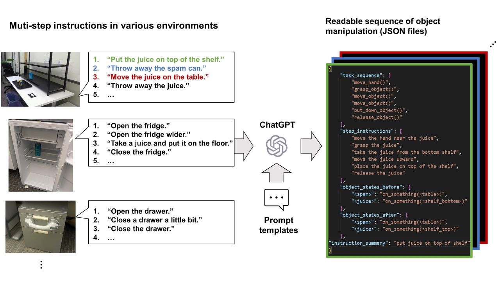

# ChatGPT-Robot-Manipulation-Prompts

This repository provides a set of prompts that can be used with OpenAI's ChatGPT to enable natural language communication between humans and robots for executing tasks. The prompts are designed to allow ChatGPT to convert natural language instructions into a sequence of executable robot actions, with a focus on robot manipulation tasks. The prompts are easy to customize and integrate with existing robot control and visual recognition systems.
For more information, please see our [blog post](https://www.microsoft.com/en-us/research/group/applied-robotics-research/articles/gpt-models-meet-robotic-applications-long-step-robot-control-in-various-environments/) and our paper, [ChatGPT Empowered Long-Step Robot Control in Various Environments: A Case Application](https://ieeexplore.ieee.org/document/10235949).



## How to use
> 🚀 **New Feature Alert**: We've updated the prompts to support the OpenAI's official API. Additionally, we've updated the prompts to support the latest version of the Azure OpenAI's API (as of September 2023).
1. We provide sample codes for using ChatGPT through [Azure OpenAI](https://learn.microsoft.com/en-us/azure/cognitive-services/openai/overview) and [OpenAI API](https://platform.openai.com/docs/api-reference). Fill in the [secrets.json](./secrets.json) with your credential information. Even if you do not have a subscription, you can try it out by copying and pasting the prompts into the [OpenAI's interface](https://chat.openai.com/).

2. If you have a subscription of Azure OpenAI or OpenAI, install the required python packages by running the following command in a terminal session (note: we have confirmed that the sample codes work with python 3.9.16):
```bash
> pip install -r requirements.txt
```
Then, go to a subfolder in [examples/](./examples) (for example, [examples/task_decomposition](./examples/task_decomposition)), run the following command to run the sample code:
```bash
python aimodel.py --scenarios <scenario_name>
```
Replace `<scenario_name>` with the name of the scenario you want to run. Specific scenario names can be found in the `aimodel.py`.

## Bibliography
```
@article{10235949,
  author={Wake, Naoki and Kanehira, Atsushi and Sasabuchi, Kazuhiro and Takamatsu, Jun and Ikeuchi, Katsushi},
  journal={IEEE Access}, 
  title={ChatGPT Empowered Long-Step Robot Control in Various Environments: A Case Application}, 
  year={2023},
  volume={},
  number={},
  pages={1-1},
  doi={10.1109/ACCESS.2023.3310935}}
@article{wake2023gpt,
  title={GPT-4V (ision) for Robotics: Multimodal Task Planning from Human Demonstration},
  author={Wake, Naoki and Kanehira, Atsushi and Sasabuchi, Kazuhiro and Takamatsu, Jun and Ikeuchi, Katsushi},
  journal={arXiv preprint arXiv:2311.12015},
  year={2023}
}
```

## Contributing

This project welcomes contributions and suggestions.  Most contributions require you to agree to a
Contributor License Agreement (CLA) declaring that you have the right to, and actually do, grant us
the rights to use your contribution. For details, visit https://cla.opensource.microsoft.com.

When you submit a pull request, a CLA bot will automatically determine whether you need to provide
a CLA and decorate the PR appropriately (e.g., status check, comment). Simply follow the instructions
provided by the bot. You will only need to do this once across all repos using our CLA.

This project has adopted the [Microsoft Open Source Code of Conduct](https://opensource.microsoft.com/codeofconduct/).
For more information see the [Code of Conduct FAQ](https://opensource.microsoft.com/codeofconduct/faq/) or
contact [opencode@microsoft.com](mailto:opencode@microsoft.com) with any additional questions or comments.

## Trademarks

This project may contain trademarks or logos for projects, products, or services. Authorized use of Microsoft 
trademarks or logos is subject to and must follow 
[Microsoft's Trademark & Brand Guidelines](https://www.microsoft.com/en-us/legal/intellectualproperty/trademarks/usage/general).
Use of Microsoft trademarks or logos in modified versions of this project must not cause confusion or imply Microsoft sponsorship.
Any use of third-party trademarks or logos are subject to those third-party's policies.
